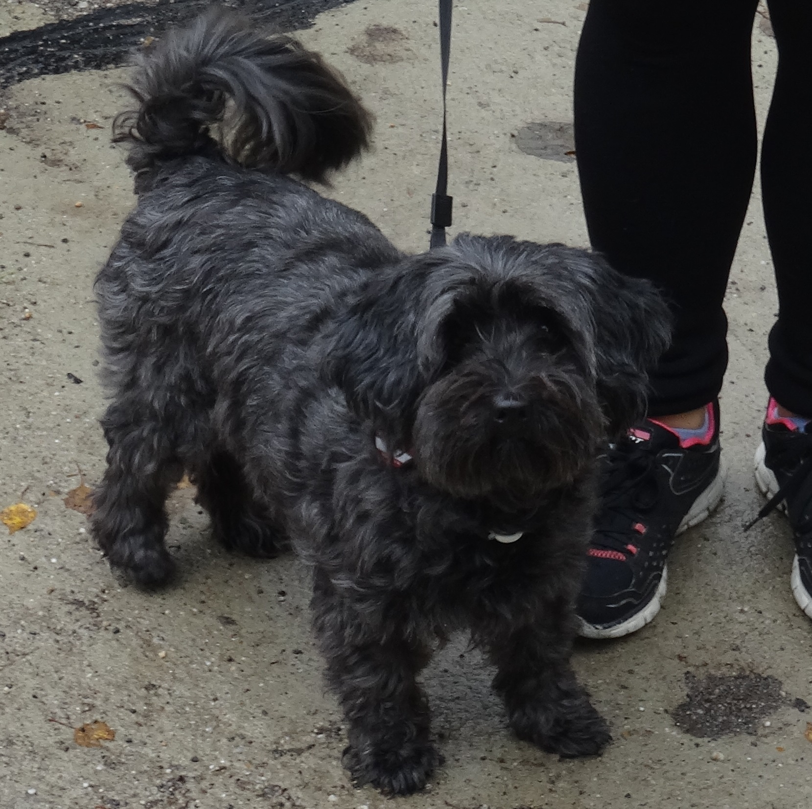

# Dogs

Dogs are the best

|command |explanation|
|---|---|
ls|list files in a given directory
cp|copy a file
mv|move a file
sudo|"super user do" run commend as super user
git|run git commands

:carrot: Dogs like carrots and cucumbers :cucumber: